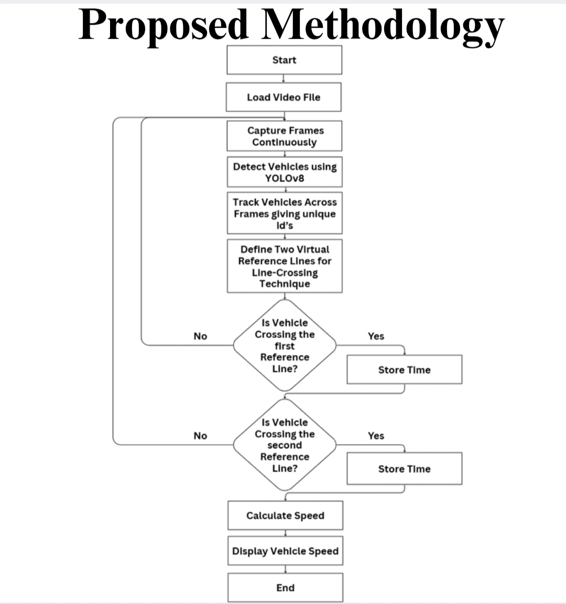
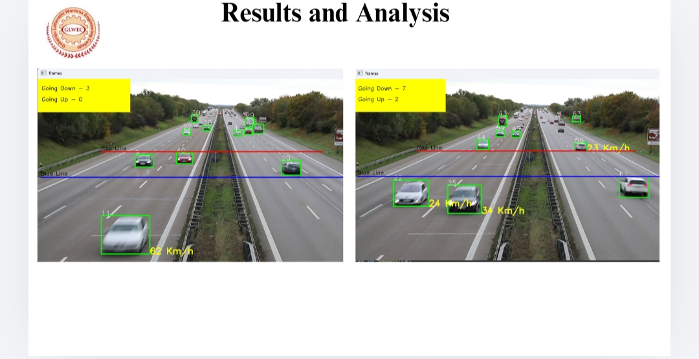
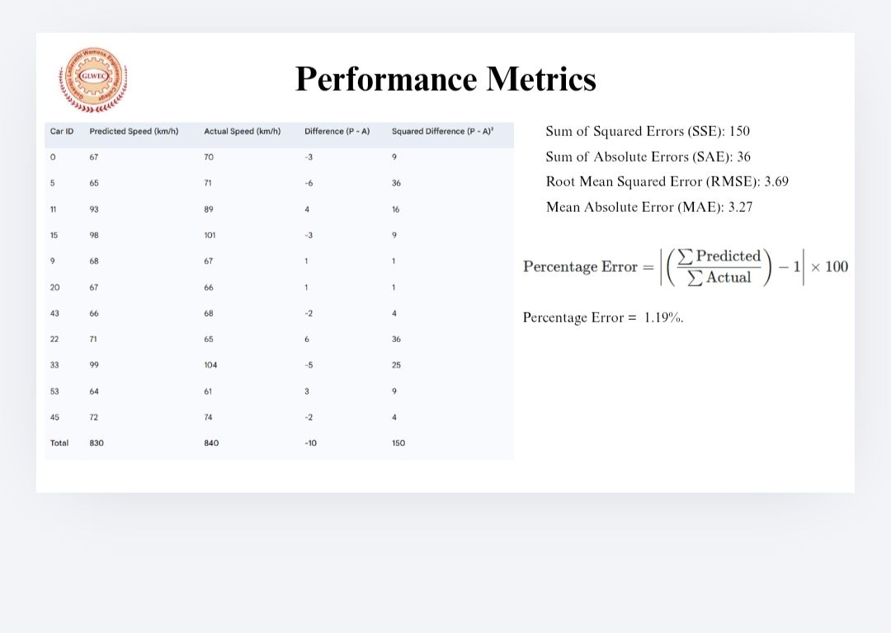

# Vehicle Detection & Speed Estimation using YOLOv8

## 📌 Project Overview
This project detects vehicles from traffic videos and estimates their speed using YOLOv8 and OpenCV.

The system performs:
- Vehicle detection using a pre-trained YOLOv8 model
- Object tracking across video frames
- Speed calculation using pixel distance and frame rate
- CSV report generation for detected vehicle speeds

---

## 🧠 Methodology
1. Load traffic video
2. Detect vehicles using YOLOv8
3. Track vehicles across frames
4. Define virtual reference lines
5. Measure time taken to cross lines
6. Calculate vehicle speed
7. Display and store results

---

## 🛠️ Technologies Used
- Python
- YOLOv8 (Ultralytics)
- OpenCV
- NumPy
- Pandas

---

## 📂 Project Structure
vehicle-detection-speed-estimation/
│
├── speed_estimate.ipynb
├── tracker.py
├── requirements.txt
├── methodology_flowchart.jpg
├── output_speed_estimation.jpg
├── performance_metrics.jpg
└── README.md

---

## 📊 Results
- Real-time vehicle detection
- Speed estimation displayed on video frames
- Output video with annotations
- CSV file containing detected speeds
  
## 📊 Methodology Flowchart

## 🚗 Output Speed Estimation

## 📈 Performance Metrics

---

## 📈 Performance
The model uses a pre-trained YOLOv8 model trained on the COCO dataset and performs real-time inference without additional training.

---

## 📹 Dataset / Input Video
The input video is a publicly available traffic surveillance video used for academic and testig purposes.  
A fixed camera angle and clear road view were chosen for accurate tracking and speed estimation.

---

## 🚀 Future Improvements
- Real-world camera calibration
- Improved speed accuracy
- Multi-lane vehicle analysis
- Deployment with CCTV systems

---

## 👩‍💻 Author
Mini Project (3rd Year BTech – IT)

